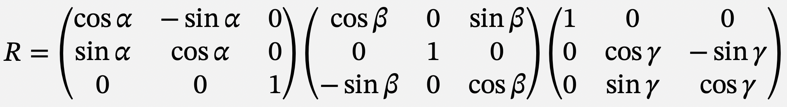

# Task 06: NumPy

**Goal:** Learn to use NumPy for numerical computations with arrays and matrices

## Overview

In this task, you'll learn:

- How to use NumPy arrays for numerical operations
- How to create and use rotation matrices
- How to work with vectors and points as tuples
- How to convert between degrees and radians

Open `task06_numpy.py` and edit the file to do the following tasks.

You may open this file on GitHub so that equations are shown properly.

## NumPy and SciPy

This task requires you to use NumPy (and SciPy in future tasks). If you haven't installed them, please refer to the [README.md](README.md) file.

## Software Design: Establishing Conventions

When starting a project, it's crucial to establish the conventions you'll use throughout.
In this lecture, angles are assumed to be in **radians** unless stated otherwise, aligning with Python's `math.sin` function.
So, functions dealing with angles in degrees must include `_degree` in their names, while other functions must not handle degrees.

Deciding on conventions **before beginning coding** (software design) is essential.
It ensures consistency and clarity throughout the project, preventing confusion and streamlining development.

### Our Conventions

This is a summary of the convention we will use:

- Angles are presumably in **radians**.
- Points and vectors are represented as **tuples**. `(3, 1)` is a point in 2d space. `(0, 0, 0)` is the origin in 3d.
- These tuples are presumably in **Cartesian coordinates**. Tuples should not be used for representation in polar coordinates.
- 2d polar coordinates are given by $x = r \cos\theta$ and $y = r \sin\theta$.
- 3d polar coordinates are given by $x = r \sin\theta \cos\phi$, $y = r \sin\theta \sin\phi$, and $z = r \cos\theta$.

## Task 06a (Required)

Complete two functions `rotation_matrix_2d(theta)` and `rotation_matrix_2d_degree(deg)`, which should give rotation matrices in 2d (see Problem 7.2.30 of the textbook).

### Specifications

- `rotation_matrix_2d(theta)` should return a 2x2 NumPy array representing the rotation matrix for the angle `theta` in **radians**.
- `rotation_matrix_2d_degree(degree)` should return a 2x2 NumPy array representing the rotation matrix for the angle `degree` in **degrees**.

- **Input**: `theta` or `degree` (float)
- **Output**: a 2x2 NumPy array

The 2D rotation matrix is:

$$
R(\theta) = \begin{pmatrix}
\cos\theta & -\sin\theta \\
\sin\theta & \cos\theta
\end{pmatrix}
$$

<details>
<summary>Click to see hint 1</summary>

Use NumPy to create arrays:

```python
import numpy as np

matrix = np.array([[a, b], 
                   [c, d]])
```

</details>

<details>
<summary>Click to see hint 2</summary>

Use NumPy's trigonometric functions:

```python
np.cos(theta)  # Cosine
np.sin(theta)  # Sine
```

These functions expect angles in radians.

</details>

<details>
<summary>Click to see hint 3</summary>

To convert degrees to radians, search online for "degree radian python" or use:

```python
np.radians(degree)  # Converts degrees to radians
# or
np.deg2rad(degree)  # Same thing
```

</details>

## Task 06b (Required)

We are going to use **tuples** to represent vectors and points. Complete a function `distance(p1, p2)` that returns the distance between two points `p1` and `p2`.

### Specifications

- **Input**: `p1` and `p2` are tuples of two floats. Namely, `(x1, y1)` and `(x2, y2)`.
- **Output**: a float representing the distance between `p1` and `p2`.

The distance formula is:

$$d = \sqrt{(x_2-x_1)^2 + (y_2-y_1)^2}$$

<details>
<summary>Click to see hint 1</summary>

You can calculate the distance using basic Python:

```python
import math
dx = p2[0] - p1[0]
dy = p2[1] - p1[1]
distance = math.sqrt(dx**2 + dy**2)
```

</details>

<details>
<summary>Click to see hint 2</summary>

Alternatively, use NumPy for a more elegant solution:

```python
import numpy as np
distance = np.linalg.norm(np.array(p2) - np.array(p1))
```

</details>

## Task 06c (Required)

Write a function `rotate(p, theta)` that rotates a point `p` around the origin by `theta` radians and returns its new coordinates after the rotation.

### Specifications

You should use `rotation_matrix_2d(theta)` from Task 06a. Also you are asked to convert `p` into a NumPy 1x2 array, rotate it by the matrix, and convert it back to a tuple.

- **Input**: `p` is a tuple of two floats. `theta` is the rotation angle in radians.
- **Output**: a tuple `(x, y)` of two floats.

<details>
<summary>Click to see hint 1</summary>

Convert tuple to NumPy array:

```python
p_array = np.array(p)
```

</details>

<details>
<summary>Click to see hint 2</summary>

Matrix multiplication in NumPy:

```python
rotated = rotation_matrix @ p_array  # Using @ operator
# or
rotated = np.dot(rotation_matrix, p_array)
```

</details>

<details>
<summary>Click to see hint 3</summary>

Convert NumPy array back to tuple:

```python
result = tuple(rotated)
```

</details>

## Task 06d (Optional)

Rotations in 3d are surprisingly more complicated than in 2d. Here we will use a convention using roll-pitch-yaw angles.

With yaw (`alpha`), pitch (`beta`), and roll (`gamma`), the rotation matrix is given by:



Write a function `rotation_matrix_3d(alpha, beta, gamma)` that returns a 3x3 NumPy array representing this matrix.

### Specifications

- **Input**: `alpha`, `beta`, `gamma` (float), representing yaw, pitch, and roll in radians.
- **Output**: a 3x3 NumPy array

<details>
<summary>Click to see hint</summary>

The combined rotation matrix is:

$$R(\alpha, \beta, \gamma) = R_z(\alpha) R_y(\beta) R_x(\gamma)$$

Where:

- $R_z(\alpha)$ is rotation around z-axis
- $R_y(\beta)$ is rotation around y-axis  
- $R_x(\gamma)$ is rotation around x-axis

You can multiply these matrices together using `@` or `np.dot()`.

</details>

---

## Common Mistakes

1. **Mixing degrees and radians**
   - ❌ Using degrees with `np.sin()` without conversion
   - ✅ Always convert to radians first or use `_degree` functions

2. **Wrong matrix dimensions**
   - ❌ Returning a 1D array instead of 2D matrix
   - ✅ Use `np.array([[a, b], [c, d]])` for 2x2 matrices

3. **Incorrect matrix multiplication**
   - ❌ Using `*` for matrix multiplication (element-wise)
   - ✅ Use `@` or `np.dot()` for matrix multiplication

4. **Not returning a tuple when required**
   - ❌ Returning a NumPy array for point coordinates
   - ✅ Convert to tuple: `tuple(array)`

---

## Understanding NumPy Arrays

### Creating Arrays

```python
import numpy as np

# From list
arr = np.array([1, 2, 3])

# 2D array (matrix)
matrix = np.array([[1, 2], 
                   [3, 4]])
```

### Array Operations

```python
# Element-wise operations
a = np.array([1, 2, 3])
b = np.array([4, 5, 6])
c = a + b  # [5, 7, 9]

# Matrix multiplication
A = np.array([[1, 2], [3, 4]])
B = np.array([[5, 6], [7, 8]])
C = A @ B  # Matrix product
```

---

## Need Help?

- Review NumPy documentation: [https://numpy.org/doc/stable/](https://numpy.org/doc/stable/)
- Understand rotation matrices and trigonometry
- Test with simple examples first (e.g., rotate (1, 0) by π/2)
- See the [python-starter-1](https://github.com/nsysu-iwamoto/python-starter-1) for setup and testing help
